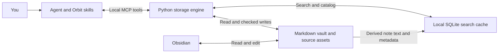
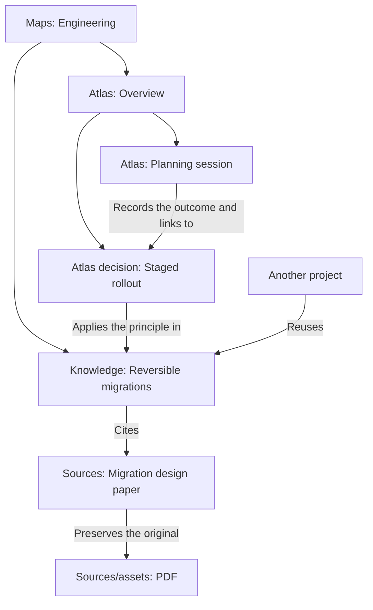
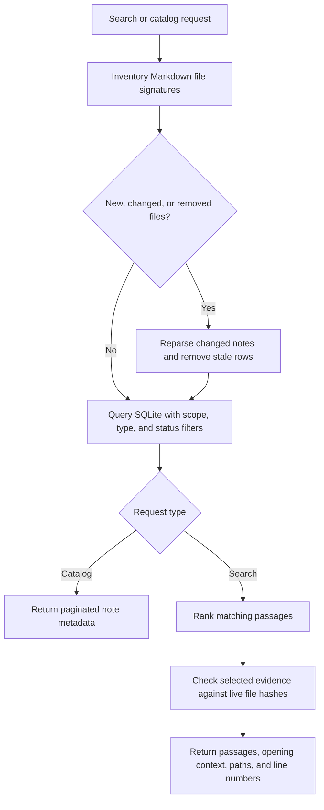

# Orbit

A plugin for saving, connecting, and recalling knowledge in your own Obsidian vault.
Say “Save that to Orbit” or “Check our deployment decisions”. The agent uses local
MCP tools; the Python engine handles storage, hashes, indexing and recovery.

Version 0.4.1 adds structured notes and recoverable migrations and remains a desktop prerelease. Markdown and preserved
sources remain authoritative. No cloud service, scheduled capture, hooks or required
Obsidian community plugin. Python 3.10+ must be installed. The launcher checks PATH and standard Homebrew
bin directories when `python3` is older; neither the plugin nor MCPB installs Python. Search uses SQLite FTS5.

## How Orbit works

Orbit keeps your knowledge in Markdown files that you can read and edit in Obsidian.
The agent decides what to save and how it connects to existing notes. Orbit's local
Python engine checks and writes those changes. On retrieval, it refreshes a local SQLite index.



The Markdown vault is the source of truth. SQLite contains a rebuildable copy of
searchable content, so losing the index does not lose your notes. Recovery journals
and integration records inside the vault are separate persistent state and are not
disposable search caches.

Read [the knowledge structure](#structured-knowledge-and-sessions) for where notes
belong, and [how SQLite works](#how-sqlite-supports-retrieval) for what the index stores.

## Install

Add the GitHub marketplace `aataraxiaa/orbit` in the app's plugin controls and install
Orbit. In Claude Cowork this is **Customize > Plugins > Add > Add marketplace**.
In Codex desktop use the Plugins directory's marketplace/source controls.
Repository marketplace installs receive updates from the repository.

Start a fresh conversation and say “Set up Orbit”. The agent must call Orbit's MCP
tools, bind your selected vault, save a labeled receipt and read it back. Installation
alone does not establish connection, access or persistence.

Claude Desktop Chat has a separate `orbit.mcpb` desktop extension package using the
same engine. Download it from [v0.4.1](https://github.com/aataraxiaa/orbit/releases/tag/v0.4.1)
and open it in Claude Desktop to install. Download and install a new MCPB for updates;
the GitHub marketplace does not update this separate extension. Its native acceptance and extension-directory publication are pending.
It is not the same distribution channel as the Cowork marketplace plugin. Ordinary
ChatGPT chat remains a separate, unverified surface; this release adds no remote
connector and does not upload or host the vault.

A disposable probe established transport in Codex desktop and Cowork. That is not
acceptance of this production artifact. See [installation and testing](LOCAL_TEST.md)
and [acceptance](references/acceptance.md) for the remaining native checks.

## Use the five skills

| Skill | Behavior |
|---|---|
| orbit-setup | Select a vault, bind it persistently, verify access |
| orbit-save | Integrate selected content, update affected knowledge and maps, verify recall |
| orbit-recall | Orient through maps or retrieve scoped evidence, follow relationships, cite sources |
| orbit-maintain | Inspect incomplete integration, stale evidence, links and provenance; repair requested issues |
| orbit-migrate | Preview, apply, resume, or roll back the appropriate versioned migration |

## Set up and inspect

`orbit_setup` selects a vault. `orbit_doctor` reports access and integrity.
`orbit_search` and `orbit_read` return evidence; `orbit_apply` saves a JSON change plan
with current hashes. The plugin's skills guide source interpretation and verification.
See [tool contracts](references/tools.md) for all operations.

Fresh setup creates format-2 folders and schema notes. Setup preserves existing notes; upgrading their organization is explicit. The config defaults to ~/.config/orbit/config.json.
ORBIT_CONFIG isolates a different config. ORBIT_VAULT and the explicit `vault` argument explicitly override the binding.
The helper never infers a vault from the working directory.

Existing Second Brain installations remain readable. Orbit uses an existing legacy config
when no new config or explicit override is selected, and accepts `SECOND_BRAIN_*` environment
variables when their `ORBIT_*` equivalents are unset. Existing vaults retain `.second-brain`
state and `SECOND_BRAIN.md` rules, including their UUIDs, recovery records and shared writer lock.
New vaults use `.orbit` and `ORBIT.md`. Conflicting old and new state directories or rules files
require manual resolution. Setup does not rename notes; the migration tool provides guarded note moves with link repairs and backup journals.

## Structured knowledge and sessions

Format 2 separates project context from knowledge you can reuse across projects.
This illustrative vault shows the intended homes for notes. The example names are
not files that setup creates.

```text
Projects/
  Atlas/
    Overview.md
    Decisions/
      Staged rollout.md
    Sessions/
      Planning session.md
Knowledge/
  Reversible migrations.md
People/
  Alex.md
Sources/
  Migration design paper.md
  assets/
    migration-design.pdf
Schemas/
  Project.md
  Decision.md
  Session.md
  ...
Maps/
  Engineering.md
ORBIT.md
.orbit/
```

| Location | What belongs here |
|---|---|
| `Projects/<project>/Overview.md` | The project's purpose and current state, with links to decisions, knowledge, sources, and sessions. |
| `Projects/<project>/Decisions/` | Choices specific to that project, including rationale and alternatives. |
| `Projects/<project>/Sessions/` | Dated summaries of work, outcomes, open questions, and next actions. |
| `Knowledge/` | Reusable concepts and explanations that can inform more than one project. |
| `People/` | Notes about people, linked from relevant projects and knowledge. |
| `Sources/` | Source notes with provenance and extracted text. Original files live under `Sources/assets/`. |
| `Schemas/` | Versioned Markdown definitions of the fields and sections expected for each note type. |
| `Maps/` | Authored navigation notes that explain how related notes fit together. |
| `ORBIT.md` | Vault rules that guide the agent. |
| `.orbit/` | Vault identity, recovery journals, migration backups, and processing records managed by Orbit. |

### Projects and knowledge without duplication

The strongest objection to separate `Projects/` and `Knowledge/` folders is that an
agent could write the same explanation twice. If both copies later change, you have
to decide which one to trust. The folder layout alone cannot prevent that.

Orbit's convention is to keep each durable fact in one canonical note and link to
it wherever it is useful. For example, Atlas's decision note records **why Atlas
chose a staged rollout**. The knowledge note explains **how reversible migrations
work in general**. Another project can link to that same knowledge note without
copying it into its own folder.



These arrows illustrate links between notes. Folders give a note one physical home;
wikilinks connect it across folders. A stable `id` identifies the note, while fields
such as `type`, `project`, and `status` describe it for validation and filtering.
Typed prose relationships can add meaning and evidence to a link.

A project overview gives brief orientation and links to the detailed notes. A session
records what happened at a particular time and links to current knowledge. Historical
summaries and short quotations can overlap with other notes without becoming competing
current explanations. Project-specific facts can stay in the project; they do not all
need a second note in `Knowledge/`.

The save skill tells the agent to search and read related notes before updating or
creating one. The engine rejects duplicate stable IDs, but it does not detect two
notes with different IDs that say the same thing. The standard folder layout is guided
by skills and migrations; ordinary saves do not enforce every note's folder placement.
Checking an existing vault for repeated content still requires reading the notes.

### Sessions and schemas

Saving a session is explicit. There is no automatic transcript capture. Session
summaries capture the objective, outcomes, open questions, next actions, observed
date, and links to current knowledge. Read those linked notes when resuming work,
since the session describes the state at the time it was saved.

Versioned Markdown schema notes describe the required fields and sections for each type.
For example, projects need `Purpose` and `Current state` sections, while decisions
need `Rationale` and `Alternatives`. Validation warns by default. Set a schema to
strict when missing fields should block a save. Use `orbit_schema` to inspect definitions
and findings. The common identity and content-preservation checks always apply.
See [the data contract](references/format.md) and [bundled schemas](references/schemas).

Use `orbit_search` or `orbit_catalog` with `note_type: "session"` to resume a project,
or `note_type: "decision"` and `status: "current"` for current decisions. Ordinary
results exclude schema notes and vault rules.

## Upgrade an existing vault

Update the plugin, start a fresh conversation, and ask to migrate your Orbit vault.
There is one `orbit-migrate` skill. It selects version-specific reference instructions
using the observed data format and target release, previews changes, and calls the
migration engine with the preview's digest. Format 1 upgrades to format 2; format 2
receives a compatibility check. Unknown formats and downgrades are refused.

Legacy markers do not identify an exact originating app release. Orbit reports that
release as unknown and routes by data format. Backups retain exact affected file bytes;
interrupted runs can resume or roll back, refusing subsequent human edits. Ambiguous
project ownership and unsupported links block the plan rather than guess. Original
assets and historical receipts remain intact. Affected integration verification becomes
historical and needs re-verification. Plugin installation never migrates a vault silently.

## How SQLite supports retrieval

SQLite is an embedded database accessed through Python's standard `sqlite3` module.
Orbit stores the index in a local `.sqlite3` file. There is no database server to run
or separate SQL service to install. The Python installation must support SQLite FTS5,
the full-text search extension that indexes words in your notes.

### What the database stores

| Table | Derived content | Purpose |
|---|---|---|
| `notes` | Paths, file signatures, content hashes, IDs, titles, aliases, summaries, and other searchable metadata. | Catalog notes, filter results, and track which files changed. |
| `passages` | Note text split into passages, with the file path, section heading, and start and end lines. | Return relevant evidence without loading whole notes into the agent's context. |
| `search` | An FTS5 index of titles, aliases, headings, passage text, and summaries. | Find and rank word matches. |

This is intentional duplication of storage, with one direction of authority. Orbit
regenerates the database from Markdown. You edit the notes, not the database. SQLite
also stores passage text, so protect the cache as you would the notes themselves.

The cache defaults to `~/.config/orbit/cache` when using the default Orbit config.
With another selected config, it defaults to a `cache` directory beside that config.
`ORBIT_CACHE` overrides the cache directory, which must remain outside the vault.
The database filename is derived from the vault's identity and absolute path. Each
machine can build its own cache from the same synced Markdown vault.

### What happens when you search



There is no background file watcher. Search and catalog requests inventory the vault,
then reparse only files whose signatures changed. This picks up edits made in Obsidian
as well as edits made through Orbit. File inventory still grows with the number of
files, even when none need reparsing.

Search applies scope, type, and status filters before limiting results. FTS5 uses
BM25 ranking, with extra weight for titles, aliases, headings, and summaries. Exact
title and alias matches receive priority. Orbit returns the best matching passage
per note with opening context, then checks selected evidence against live files.
Edits after that check remain possible.

The indexed response has a 12,000-character serialized limit, not a guaranteed token
limit. Agents can read additional windows when results are truncated. This reduces
how much text recall needs to send to the agent while keeping citations traceable.

### Index boundaries and rebuilding

Original assets under `Sources/assets/` are not indexed. A source note needs saved
extracted text for that content to be searchable. Hidden directories are skipped.
Schema notes and vault rules can exist in the index, but ordinary search and catalog
results exclude them. Requesting `note_type: "schema"` exposes schema notes.

SQLite currently supports search and the catalog. Context traversal and explicit
relationship inspection still read Markdown notes directly. The database is not a
complete graph of every relationship, and schemas in `Schemas/` describe Markdown
notes rather than SQL tables.

`orbit_index` with `rebuild: true` recreates the derived index without rewriting notes.
The engine also rebuilds an incompatible index schema. Rebuilding SQLite is separate
from migrating the vault's data format, which can move notes or update persistent
state and therefore needs the migration skill and backups.

Search is lexical, not semantic. Agents expand indirect questions and follow maps
and links. There are no embedding models or model downloads during recall. QMD was
evaluated as a local candidate but is not a runtime dependency.

When indexing is unavailable, unfiltered search reports degradation and uses the live
lexical scan. Scoped or typed search reports unavailable rather than returning unrelated
notes. See [the retrieval implementation](scripts/retrieval.py) for the table definitions,
refresh logic, filters, and ranking.

## Maintain knowledge and navigation

The catalog provides paginated inventory without overwriting authored maps. Save and maintain skills create and update
useful entry, project, and topic maps through ordinary conflict-checked writes. Map explanations require agent judgment.
Explicit prose relationships retain type, direction, basis, source line and hash. Untyped wikilinks remain navigation.
Recorded relationships are claims, not independently verified facts.

Captured sources have durable processing records. Stages distinguish capture, extraction, integration and verified retrieval.
Extraction requires saved text evidence and declared coverage. Integration references committed note operations and current hashes.
Verification executes recall queries. Partial extraction and deferred work remain visible. This verifies mechanical evidence,
not factual truth or completeness of an LLM's interpretation. See [tool contracts](references/tools.md).

Maintenance reports unfinished integration, changed evidence, broken links, malformed records and missing code provenance.
It does not automatically reconcile facts or execute repository paths from notes. Current-code claims require live source checks.

## Preserve existing work

Apply validates stable IDs, expected hashes, required metadata and link targets, including literal headings and block anchors.
Unknown metadata blocks must remain verbatim. The skill must still preserve unrelated user prose during full-note replacement.
Changes use per-file atomic writes and recovery journals. A batch is recoverable, not filesystem-atomic.
External editors do not honor the helper lock. Checks immediately before writes narrow but cannot eliminate that race.
Recovery refuses subsequent edits. Explicit `orbit_recover` with `abandon: true` preserves current files and releases a conflicted operation
for replanning; it does not undo partial writes. Journals contain historical content and require the same protection as notes.

The parser supports common YAML scalars and lists, not arbitrary YAML interpretation. Ordinary saving cannot rename or delete notes. Explicit migrations perform guarded moves.

## Test, package and install

```sh
python3 -m unittest discover -s tests -v
python3 scripts/smoke.py
python3 scripts/eval.py --output /absolute/evaluation.json
python3 scripts/package.py
```

Tests and smoke runs use disposable vaults. The evaluation uses labeled synthetic notes and reports helper retrieval only.
Real host, fresh-chat and LLM behavior are separate acceptance checks. See [acceptance](references/acceptance.md).
Build outputs are `dist/orbit-plugin.zip`, `dist/orbit.mcpb`, and `dist/orbit-project.zip`; local marketplaces are under `dist/marketplace`.
See [local installation](LOCAL_TEST.md). Keep personal-vault adoption separate from package verification.
Release ZIPs are available from [GitHub Releases](https://github.com/aataraxiaa/orbit/releases).

## Prerelease limitations

Search uses lexical matching. The previous development evaluation retrieved all required evidence
for 50 of 60 harder synthetic questions, below the 95% target. Paraphrases and questions needing
multiple notes remain the main gaps. This is a helper retrieval measurement, not an LLM accuracy score.
A fresh Codex CLI conversation passed the earlier save/recall scenario. Claude execution and
Desktop/Cowork behavior have not passed equivalent acceptance checks. See [acceptance](references/acceptance.md).

## References

The design draws on [Obsidian Second Brain](https://github.com/eugeniughelbur/obsidian-second-brain),
[Karpathy's wiki pattern](https://gist.github.com/karpathy/442a6bf555914893e9891c11519de94f),
[Basic Memory](https://github.com/basicmachines-co/basic-memory),
[Ars Contexta](https://github.com/agenticnotetaking/arscontexta), and [QMD](https://github.com/tobi/qmd).
No upstream implementation code is vendored.
